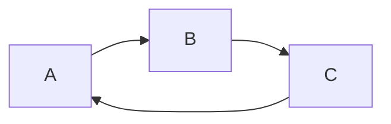
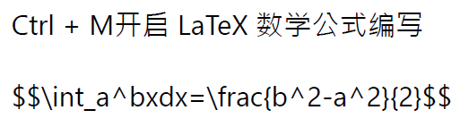

[toc]

---
Use markdown all in one to create/update toc from command line
需要手动更新
- [缩写](#%e7%bc%a9%e5%86%99)
- [1. Visual Studio Code Introduction](#1-visual-studio-code-introduction)
- [2. 插件/Extension](#2-%e6%8f%92%e4%bb%b6extension)
  - [自动生成并更新目录](#%e8%87%aa%e5%8a%a8%e7%94%9f%e6%88%90%e5%b9%b6%e6%9b%b4%e6%96%b0%e7%9b%ae%e5%bd%95)
- [3.Markdown Preview Enhanced](#3markdown-preview-enhanced)
- [Problem](#problem)
- [好大的一个问题。。。](#%e5%a5%bd%e5%a4%a7%e7%9a%84%e4%b8%80%e4%b8%aa%e9%97%ae%e9%a2%98)
- [基本语法](#%e5%9f%ba%e6%9c%ac%e8%af%ad%e6%b3%95)


---
# 缩写

MPE: Markdown Preview Enhanced

# 1. Visual Studio Code Introduction
Visual Studio Code 原生就支持高亮Markdown的语法，想要一边编辑一遍预览，有两种方法：

1.Ctrl + Shift + P 调出命令面板，输入关键词，找到相应的命令并回车来执行。预览 Markdown 文件的命令叫做「Markdown: Open Preview to the Side」，即「在旁边打开 Markdown 预览」，我们可以通过这一方式直接调出侧边的 Markdown 预览面板。

2.我们也可以通过每个 Markdown 文件右上角的按钮直接打开侧边预览，或者通过快捷键 Ctrl + K V来调出。
# 2. 插件/Extension
Markdown All in One 这个插件有着非常强大的 Markdown 文档辅助编写功能，

快捷键快捷键操作

Ctrl + B**加粗**

Ctrl + I*斜体*

Alt + S~~删除线~~

Ctrl + M开启 LaTeX 数学公式编写

$$\int_a^bxdx=\frac{b^2-a^2}{2}$$

批注。MPE 支持用 == 来高亮一段文字。
我是==沈涛==

Markdown All in One 内置有上表所示的快捷键，我们可以直接利用快捷键将文字赋予格式、或进行某种操作，非常方便。自动生成并更新目录
## 自动生成并更新目录
Markdown All in One 插件可以自动根据你正在编辑的文档，生成相应的目录。我们利用快捷键 Ctrl + Shift + P 调出「命令面板」，输入「目录」，即可直接调用命令「Markdown: 创建目录」。之后如果你更新了文章内容，也可以直接通过命令「Markdown：更新目录」更新。

# 3.Markdown Preview Enhanced
```flow
st=>start: Start:>http://www.google.com[blank]
e=>end:>http://www.google.com
op1=>operation: My Operation
sub1=>subroutine: My Subroutine
cond=>condition: Yes
or No?:>http://www.google.com
io=>inputoutput: catch something...
para=>parallel: parallel tasks

st->op1->cond
cond(yes)->io->e
cond(no)->para
para(path1, bottom)->sub1(right)->op1
para(path2, top)->op1
```

# Problem

导出后发现公式无法显示



进入扩展插件的template.html文件夹
```
C://Users/username/.vscode/extensions/yzane.markdown-pdf-1.4.1/template/template.html
```

加入以下两行代码到末尾

```
<script type="text/javascript" src="http://cdn.mathjax.org/mathjax/latest/MathJax.js?config=TeX-AMS-MML_HTMLorMML"></script>

<script type="text/x-mathjax-config"> MathJax.Hub.Config({ tex2jax: {inlineMath: [['$', '$']]}, messageStyle: "none" });</script>

```
# 好大的一个问题。。。
图片。。。和latex一样需要把图片单独存下来。。。

# 基本语法
* 无序列表
  * sub
+ 可以
- 行间距有点奇怪。。。

1. 一
2. 二
3. 三
3. 四

自动纠正排序不错

---
分割线1

    空四格
    会被认为代码段
    
分割线2
***
Emoji:smile:

被三个单撇号（键盘左上角那个键）包裹的文本块会被认为是代码，这和 Github 的习惯是一致的。（注意！这和 Markdown 原始的规则是不同的。）在单撇号后面加上语言的名字就可以享受到对应语言的语法高亮。

```python
import sys
import pandas as pd

for i in range(10):
    print(i)
```

---
把别的文档插入Markdown
@import "2017-04-10-testing-post.txt"


<!-- 
@import "2017-4-11-NDF.md"  
->
